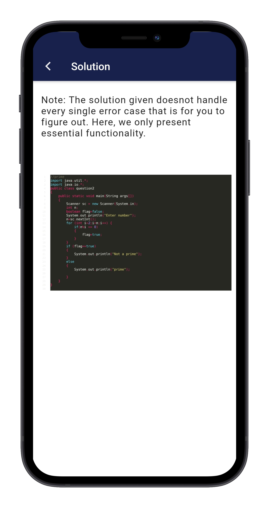

<h2 align="center">CODING DOJO</h2>

   

:heavy_check_mark: A cross-platform app that teaches you programming logic using Java.

:heavy_check_mark: Currently at 6000+ <a target="_blank" href="https://play.google.com/store/apps/details?id=com.traveltest.coding_dojo_app">Google Playstore downloads</a>. 

## Some Firebase Analytics
 

## Screenshots

        
 
